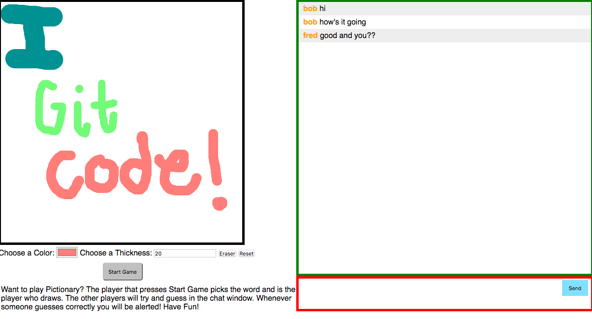
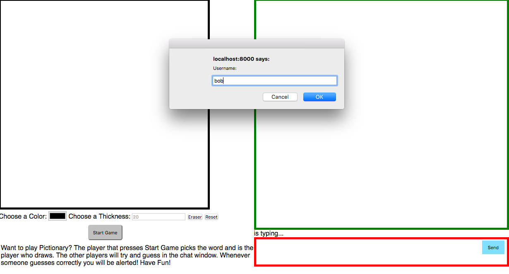
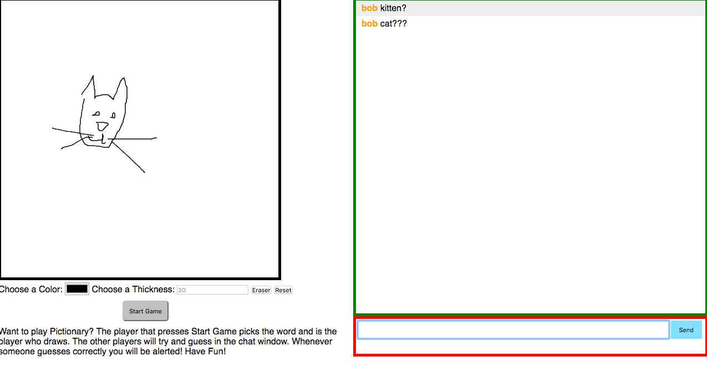

#Draw-Together-Pictionary

###Overview of the Project

Want to draw a collaborative picture or maybe even play pictionary with anyone? The play to hit start game first gets to choose the word and draw. The other players will be the ones guessing in the chat box.

##Technologies Used
* HTML Canvas
* CSS3
* Socket.io
* Node.js
* Express
* JavaScript

###Contributions to Add
1. Add dictionary of words to be given randomly to the draw-together

##URL to Live Project
[Check it out here](https://draw-together-ifyfcinztz.now.sh)

##Screen Shots

